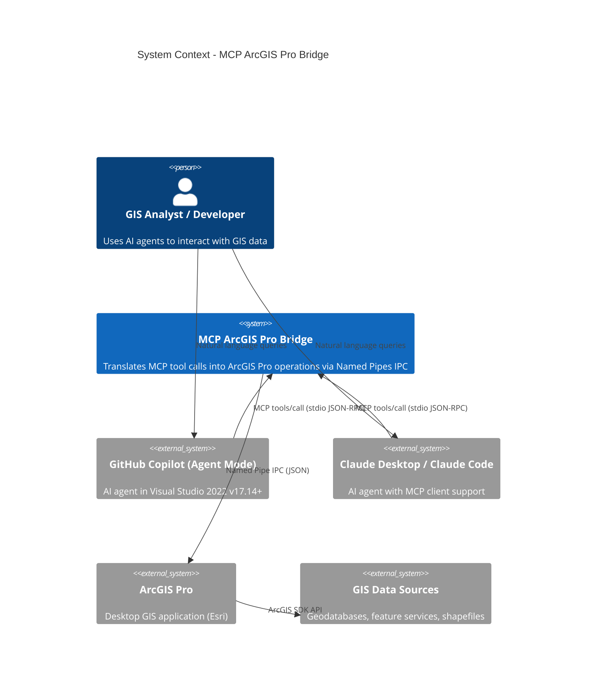

# C4 Model: Level 1 - System Context

## System Context Diagram



## Actors

| Actor | Type | Description | Interface |
|-------|------|-------------|-----------|
| GIS Analyst | Human | End user querying map data via AI | Natural language |
| GitHub Copilot | External System | VS 2022 AI agent (Agent Mode) | MCP stdio |
| Claude Desktop | External System | Anthropic AI client with MCP | MCP stdio |
| ArcGIS Pro | External System | Desktop GIS application | In-process SDK |
| GIS Data Sources | External System | Geodatabases, services, files | ArcGIS data access |

## System Boundaries

```
┌─────────────────────────── Trust Boundary ───────────────────────────┐
│                                                                       │
│  ┌──────────────┐    stdio     ┌──────────────┐  Named Pipe  ┌────┐│
│  │  MCP Client  │◄────────────►│  MCP Server  │◄────────────►│Add-││
│  │  (Copilot/   │  JSON-RPC    │  (.NET 8)    │  JSON IPC    │In  ││
│  │   Claude)    │              │              │              │    ││
│  └──────────────┘              └──────────────┘              └────┘│
│                                                                       │
│                         Single Windows Machine                        │
└───────────────────────────────────────────────────────────────────────┘
```

- All communication is local (same machine)
- No network boundaries crossed
- Windows user session provides process isolation
- Named Pipe is local-only by default (server name `.`)

## External Dependencies

| Dependency | Version | Purpose | Risk |
|-----------|---------|---------|------|
| .NET 8 SDK | 8.0.x | Runtime for both projects | Low - stable LTS |
| ArcGIS Pro | 3.5+ | GIS platform | Medium - version coupling |
| ArcGIS Pro SDK | Matches Pro | In-process API | Medium - breaking changes |
| ModelContextProtocol NuGet | 0.3.0-preview.2 | MCP server framework | High - preview/unstable |
| Visual Studio 2022 | 17.14+ | MCP Agent Mode host | Low - optional |
