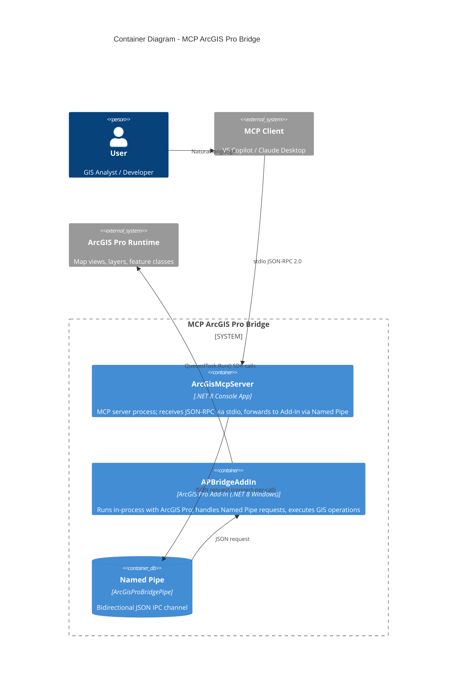
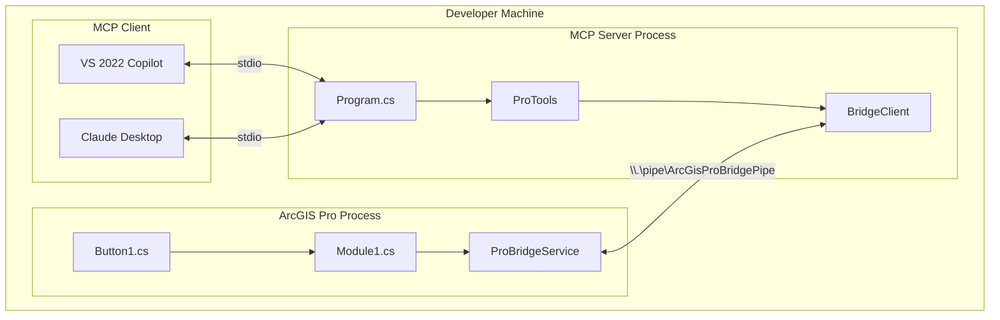

# C4 Model: Level 2 - Container Diagram

## Container Architecture



## Container Details

### ArcGisMcpServer (MCP Server)

| Property | Value |
|----------|-------|
| **Type** | .NET 8 Console Application |
| **Entry Point** | `McpServer/ArcGisMcpServer/Program.cs` |
| **Transport** | stdio (stdin/stdout) |
| **Protocol** | JSON-RPC 2.0 (MCP specification) |
| **NuGet Packages** | `ModelContextProtocol` 0.3.0-preview.2, `Microsoft.Extensions.Hosting` 8.0.0 |
| **Lifetime** | Started by MCP client, runs until client terminates |
| **Configuration** | `.mcp.json` (solution root) |

**Responsibilities:**
- Register MCP tools via `[McpServerToolType]` attributes
- Receive JSON-RPC tool calls over stdio
- Translate MCP calls to IPC requests via `BridgeClient`
- Return results to MCP client

### APBridgeAddIn (ArcGIS Pro Add-In)

| Property | Value |
|----------|-------|
| **Type** | ArcGIS Pro SDK Add-In (WPF) |
| **Entry Point** | `AddIn/APBridgeAddIn/Module1.cs` |
| **Transport** | Named Pipe server |
| **Target Framework** | net8.0-windows8.0 |
| **Runtime** | In-process with ArcGIS Pro |
| **Activation** | Manual (Button1 click) |
| **Packaging** | `.esriAddinX` file |

**Responsibilities:**
- Host Named Pipe server on background thread
- Parse JSON IPC requests
- Route operations to `HandleAsync` switch
- Execute ArcGIS SDK calls via `QueuedTask.Run()`
- Return JSON responses

### Named Pipe Channel

| Property | Value |
|----------|-------|
| **Name** | `ArcGisProBridgePipe` |
| **Direction** | Bidirectional (InOut) |
| **Mode** | PipeTransmissionMode.Message |
| **Max Instances** | 1 (sequential) |
| **Scope** | Local machine only (`.`) |
| **Options** | PipeOptions.Asynchronous |

## Process Topology

```
┌─────────────────────────────────────────────┐
│                 Windows OS                   │
│                                              │
│  ┌─────────────────────┐                    │
│  │    ArcGIS Pro.exe   │                    │
│  │  ┌───────────────┐  │                    │
│  │  │ APBridgeAddIn │  │  Named Pipe       │
│  │  │ (in-process)  │◄─┼──────────────┐    │
│  │  │               │  │              │    │
│  │  └───────────────┘  │              │    │
│  └─────────────────────┘              │    │
│                                        │    │
│  ┌─────────────────────┐              │    │
│  │ ArcGisMcpServer.exe │              │    │
│  │  (console app)      │──────────────┘    │
│  │                      │                   │
│  │  stdin ◄── MCP Client                   │
│  │  stdout ──► MCP Client                  │
│  └─────────────────────┘                    │
└─────────────────────────────────────────────┘
```

## Deployment View


