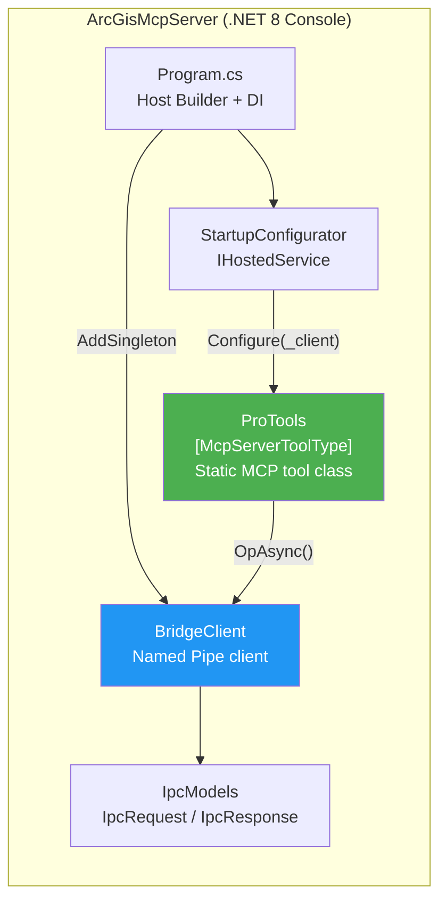
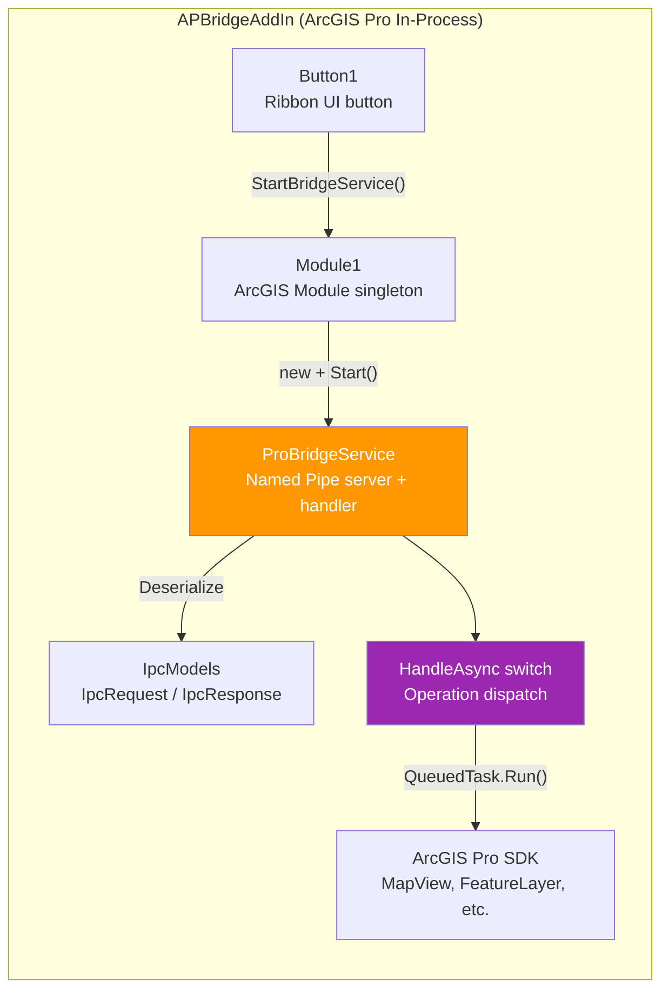
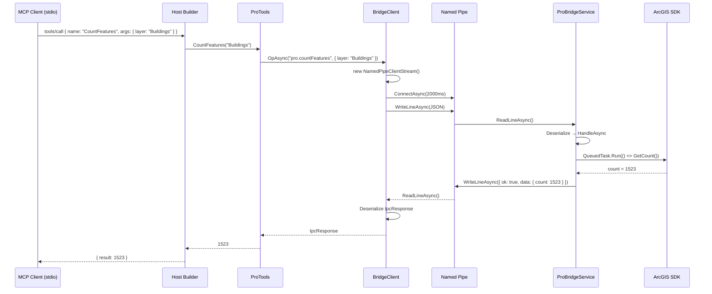

# C4 Model: Level 3 - Component Diagram

## MCP Server Components



### Component Responsibilities

| Component | File | Responsibility |
|-----------|------|----------------|
| **Program** | `Program.cs` | Configures DI container, registers MCP server with stdio transport, starts hosted service |
| **StartupConfigurator** | `Program.cs` | `IHostedService` that injects `BridgeClient` into static `ProTools` on startup |
| **ProTools** | `Tools/ProTools.cs` | Static class with `[McpServerTool]` methods; each method calls `BridgeClient.OpAsync()` |
| **BridgeClient** | `Ipc/BridgeClient.cs` | Creates per-request Named Pipe client connections, serializes/deserializes JSON |
| **IpcModels** | `Ipc/IpcModels.cs` | `IpcRequest(Op, Args)` and `IpcResponse(Ok, Error, Data)` record types |

### MCP Tool Registry

```
[McpServerToolType] ProTools
├── GetActiveMapName()  → "pro.getActiveMapName"
├── ListLayers()        → "pro.listLayers"
├── CountFeatures(layer) → "pro.countFeatures"
├── ZoomToLayer(layer)   → "pro.zoomToLayer"
├── Ping()              → (local, no IPC)
└── Echo(text)          → (local, no IPC)
```

## Add-In Components



### Component Responsibilities

| Component | File | Responsibility |
|-----------|------|----------------|
| **Module1** | `Module1.cs` | Add-In module singleton; holds `ProBridgeService` instance; disposes on Pro shutdown |
| **Button1** | `Button1.cs` | Ribbon button; calls `Module1.Current.StartBridgeService()` on click |
| **ProBridgeService** | `ProBridgeService.cs` | Creates pipe server, runs accept loop on background task, dispatches to `HandleAsync` |
| **HandleAsync** | `ProBridgeService.cs` | Switch statement routing `req.Op` to ArcGIS SDK calls wrapped in `QueuedTask.Run()` |
| **IpcModels** | `IpcModels.cs` | Same schema as MCP server side (independently defined) |

### Operation Handler Map

```
HandleAsync(req) switch on req.Op:
├── "pro.getActiveMapName" → MapView.Active?.Map?.Name
├── "pro.listLayers"       → Map.Layers.Select(l => l.Name)
├── "pro.countFeatures"    → FeatureLayer.GetFeatureClass().GetCount()
├── "pro.zoomToLayer"      → MapView.Active.ZoomToAsync(layer)
├── "pro.selectByAttribute"→ FeatureLayer.Select(QueryFilter)
└── default                → error: "op not found"
```

## Interaction Between Components


