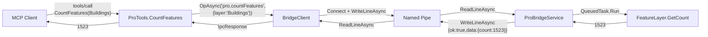
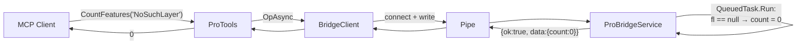
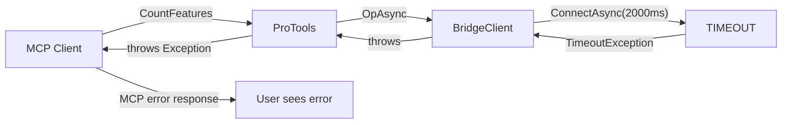

# Data Flow Architecture

## Request Lifecycle

A complete request flows through 4 protocol layers:

```
Layer 1: Natural Language    "How many buildings are there?"
Layer 2: MCP JSON-RPC        { method: "tools/call", params: { name: "CountFeatures" } }
Layer 3: IPC JSON             { op: "pro.countFeatures", args: { layer: "Buildings" } }
Layer 4: ArcGIS SDK           QueuedTask.Run(() => featureClass.GetCount())
```

## Protocol Specifications

### Layer 2: MCP Protocol (stdio)

**Transport**: stdin/stdout, newline-delimited JSON-RPC 2.0

**Tool Call Request:**
```json
{
  "jsonrpc": "2.0",
  "id": 1,
  "method": "tools/call",
  "params": {
    "name": "CountFeatures",
    "arguments": {
      "layer": "Buildings"
    }
  }
}
```

**Tool Call Response:**
```json
{
  "jsonrpc": "2.0",
  "id": 1,
  "result": {
    "content": [{ "type": "text", "text": "1523" }]
  }
}
```

### Layer 3: IPC Protocol (Named Pipe)

**Transport**: `\\.\pipe\ArcGisProBridgePipe`, UTF-8, newline-delimited JSON

**IPC Request:**
```json
{"op":"pro.countFeatures","args":{"layer":"Buildings"}}
```

**IPC Response (success):**
```json
{"ok":true,"error":null,"data":{"count":1523}}
```

**IPC Response (error):**
```json
{"ok":false,"error":"arg 'layer' required","data":null}
```

## Data Type Mapping

| MCP Tool Parameter | IPC Args Key | C# Type | ArcGIS SDK Type |
|--------------------|-------------|---------|-----------------|
| `layer` (string) | `"layer"` | `string` | Layer name lookup |
| `text` (string) | *(n/a)* | `string` | *(echo only)* |
| `where` (string) | `"where"` | `string` | `QueryFilter.WhereClause` |

## IPC Message Schema

```
IpcRequest record:
  op:   string              // Operation identifier (e.g., "pro.listLayers")
  args: Dict<string,string>? // Optional key-value arguments

IpcResponse record:
  ok:    bool               // Success flag
  error: string?            // Error message (null on success)
  data:  object?            // Result payload (null on error)
```

**Serialization**: `System.Text.Json.JsonSerializer` with `JsonPropertyName` attributes.

## Data Flow Diagrams

### Happy Path: CountFeatures



### Error Path: Layer Not Found



### Error Path: Pipe Not Available



## Connection Lifecycle

### Current: Connect-Per-Request

```
For each MCP tool call:
  1. new NamedPipeClientStream(".", "ArcGisProBridgePipe", InOut)
  2. ConnectAsync(2000ms timeout)
  3. WriteLineAsync(JSON request)
  4. ReadLineAsync() → JSON response
  5. Dispose (closes connection)
```

### Server-Side Pipe Lifecycle

```
ProBridgeService.RunAsync() loop:
  while (!cancelled):
    1. new NamedPipeServerStream("ArcGisProBridgePipe", InOut, 1, Message, Async)
    2. WaitForConnectionAsync()          // blocks until client connects
    3. while (connected && !cancelled):
       a. ReadLineAsync()                // read request
       b. HandleAsync(request)           // dispatch to SDK
       c. WriteLineAsync(response)       // send response
    4. Dispose pipe (client disconnected)
    5. Loop back to step 1
```

Note: The server supports **multiple sequential requests per connection** (inner while loop at step 3), but the client currently **disconnects after each request** (connect-per-request pattern in BridgeClient).
